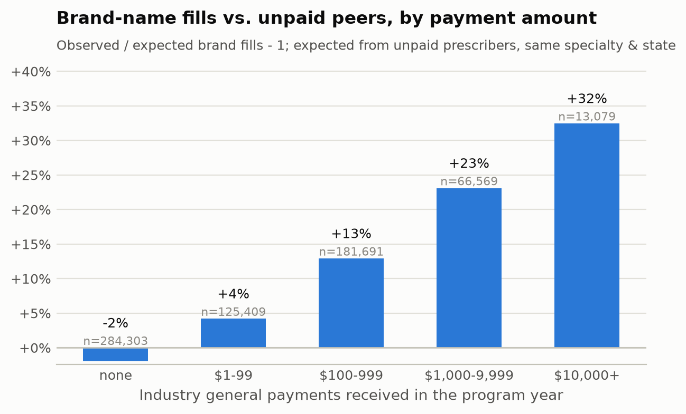
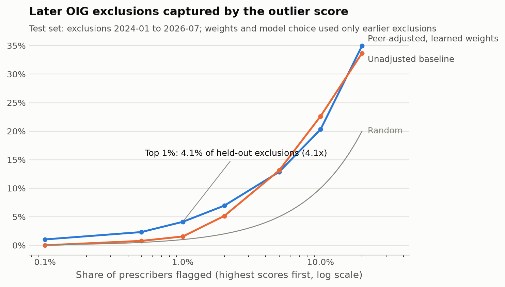
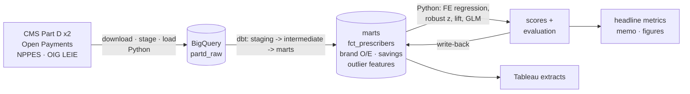

# Medicare Part D Prescribing Risk Analysis

[](https://github.com/bravorod/medicare/actions/workflows/ci.yml)


**SQL (BigQuery) · dbt · Python · Tableau**

This project joins the public Medicare Part D prescriber files with CMS Open
Payments, the NPPES provider registry and the HHS-OIG exclusion list to answer
three questions:

1. **Do prescribers who take industry money write more brand-name drugs** than
   comparable peers in the same specialty and state?
2. **What would it save Medicare** if they used generics at their unpaid peers'
   rate?
3. **Can an explainable, peer-adjusted outlier score point to prescribers
   who were later excluded from Medicare?** Weights are learned on 2022-23
   exclusions and the score is tested on 2024-26 exclusions it never saw.

## Headline results

<!-- HEADLINE:START -->
| Metric | Result | Notes |
|---|---|---|
| Potential Part D savings (generic substitution) | **$128M** | gross drug cost; sensitivity table in the memo |
| Raw records processed | **47M+** | 5 public sources |
| Brand-name fills, industry-paid vs. unpaid peers | **+14%** | peer-adjusted; regression +13% (95% CI 12%-15%) |
| Later OIG exclusions captured by top 1% of outlier scores | **4.1x** | held-out 2024-2026 exclusions: 16 of 389 (95% CI 2.4x-6.2x) |

_Data year 2021; generated 2026-09-24 from `duckdb`. Full detail: [`reports/results/headline_metrics.json`](reports/results/headline_metrics.json), [memo](reports/memo/memo.md)._

<p align="center">
  
  
</p>
<!-- HEADLINE:END -->

Plain-language write-up: [`reports/memo/memo.md`](reports/memo/memo.md) ·
Dashboard spec: [`tableau/README.md`](tableau/README.md) ·
Metric definitions: [`docs/methodology.md`](docs/methodology.md)

## How it works



| Step | What happens | Where |
|---|---|---|
| **Ingest** | URLs resolved from CMS/OIG catalogs, files checksummed, columns validated against config, loaded as all-string Parquet with a provenance table | `src/partd_risk/ingest/` |
| **Transform** | 30 dbt models and 123 data tests: typing and cleaning, drug reference, cohort and peer groups, brand O/E, savings, feature table, reporting | `dbt/models/` |
| **Brand gap** | Indirect standardization against **unpaid peers in the same specialty and state**, checked with a Poisson GLM with case-mix controls and peer-clustered SEs | `mart_brand_peer_comparison`, `modeling/brand_effect.py` |
| **Savings** | Excess brand fills on multi-source drugs, netted within specialty x drug and priced at the national brand-minus-generic cost, with a rebate sensitivity table | `mart_generic_substitution_savings` |
| **Outlier score** | Nine metrics, each regressed on peer-group fixed effects + beneficiary case-mix; robust z of the residuals; non-negative weights learned by logistic regression on **2022-23** exclusions | `modeling/peer_adjust.py`, `modeling/weights.py` |
| **Validation** | Lift at 0.1%-20% on **held-out 2024-26** exclusions, bootstrap CI, equal-weight and unadjusted baselines | `evaluation/lift.py`, `pipeline.py` |
| **Reporting** | Headline JSON, filled summary bullets, memo, figures, README table, de-identified Tableau extracts | `reporting/` |

The same dbt project runs on **BigQuery** (production) and **DuckDB** (CI).
Dialect differences sit behind dispatch macros, and CI parses the compiled
BigQuery SQL on every push. See [architecture](docs/architecture.md) and
[ADR 0001](docs/decisions/0001-bigquery-dbt-with-duckdb-for-ci.md).

## Quickstart

**Try the whole pipeline with no cloud account.** This
runs on simulated data, and every output is watermarked:

```bash
python -m venv .venv && source .venv/bin/activate
make setup
make synthetic-results        # synthetic load -> dbt build -> model -> memo/figures/extracts
```

**Production run on BigQuery** (real data):

```bash
cp .env.example .env          # set GCP_PROJECT
gcloud auth application-default login
make bigquery                 # download -> stage -> load -> dbt -> model -> results -> tableau
```

Step-by-step with checks: [`docs/runbook_bigquery.md`](docs/runbook_bigquery.md).

## Repository layout

```text
├── config/
│   ├── pipeline.yml              # sources, columns kept, paths, warehouse
│   └── outlier_score.yml         # score features, transforms, weights, evaluation k
├── dbt/
│   ├── models/
│   │   ├── staging/              # 5 typed views, one per source
│   │   ├── intermediate/         # drug reference, fills, payments, exclusions, cohort
│   │   ├── marts/                # fct_prescribers, dim_drugs, brand O/E, savings, features
│   │   ├── reporting/            # rpt_* tables for Tableau and the memo
│   │   ├── post_ml/              # models built on the Python scores
│   │   └── exposures.yml         # Tableau dashboard + memo lineage
│   ├── macros/                   # cross-database dispatch, cleaning helpers
│   ├── seeds/                    # payment categories, OIG exclusion types, state regions
│   ├── tests/                    # singular data tests
│   └── analyses/                 # validation queries (brand rule vs CMS, NPI match rate)
├── src/partd_risk/
│   ├── ingest/                   # catalog, download, stage, load
│   ├── modeling/                 # peer adjustment, outlier score, brand GLM
│   ├── evaluation/               # lift, bootstrap, discrimination
│   ├── reporting/                # headline, memo, figures, tableau, data dictionary
│   ├── pipeline.py               # model-step orchestration
│   ├── synthetic.py              # simulated raw data for CI
│   └── cli.py                    # `partd-risk` command
├── notebooks/                    # 01 profiling · 02 brand & payments · 03 score · 04 validation
├── reports/                      # memo template, results, figures (filled by the run)
├── tableau/                      # dashboard build spec + extracts
├── docs/                         # methodology, runbook, sources, ethics, ADRs, data dictionary
├── tests/                        # unit + end-to-end integration tests
└── .github/                      # CI, PR / issue templates
```

## Data

| Source | Publisher | Vintage | Grain |
|---|---|---|---|
| Part D Prescribers - by Provider and Drug | CMS | 2021 | prescriber x drug |
| Part D Prescribers - by Provider | CMS | 2021 | prescriber |
| Open Payments General Payments | CMS | program year 2021 | payment |
| NPPES NPI Registry | CMS | current monthly file | NPI |
| List of Excluded Individuals/Entities | HHS-OIG | current snapshot | exclusion |

2021 is the first Open Payments year that publishes recipient NPIs, and it
leaves several years of follow-up for later exclusions. Details, sizes and
quirks: [`docs/data_sources.md`](docs/data_sources.md).

## Quality

- **123 dbt data tests**: keys, accepted values and ranges, relationships,
  reconciliations (cohort flow sums, savings roll-ups), and a check that unpaid
  prescribers' O/E is about 1.
- **Unit tests** for every module. For example, peer adjustment recovers a
  planted case-mix slope, bootstrap CIs bracket the estimate, the GLM recovers
  a planted rate ratio, and headline formatting and the synthetic guard behave.
- **Integration test**: synthetic load -> `dbt build` -> model -> post-ML dbt
  -> results -> Tableau export, asserting that no extract contains NPIs.
- **CI**: ruff, tests on Python 3.10-3.12, dbt on DuckDB, dbt compile for
  BigQuery + sqlglot parse of all compiled models.
- **Provenance**: every raw table records its URL, SHA-256 and row count.
  Synthetic loads are flagged, and no headline number can come from them.

## Responsible use

The brand-prescribing gap is an **association**. Manufacturers choose whom to
pay. Savings are **potential, gross of rebates**. A high outlier score means
**"worth a closer look," not wrongdoing**. Extracts are aggregated or
pseudonymized, and no individual prescriber is named in any deliverable. See
[`docs/limitations_and_ethics.md`](docs/limitations_and_ethics.md).

## Documentation

| Doc | |
|---|---|
| [Methodology](docs/methodology.md) | Every metric's definition, with the model or function that computes it |
| [Where each headline number comes from](docs/results_placeholders.md) | Placeholder -> JSON key -> model -> definition |
| [Runbook: BigQuery](docs/runbook_bigquery.md) | Production run, warnings to check, cost control |
| [Architecture](docs/architecture.md) | Pipeline and lineage diagrams, layers |
| [Data sources](docs/data_sources.md) | Sources, vintages, quirks and handling |
| [Limitations & ethics](docs/limitations_and_ethics.md) | What the results can and cannot support |
| [Decision records](docs/decisions/README.md) | Why indirect standardization, why unsupervised, and more |
| [Data dictionary](docs/data_dictionary.md) | Generated from the dbt YAML |
| [Tableau spec](tableau/README.md) | Extracts, calculated fields, layout |

## License

[MIT](LICENSE). The source data are US government works in the public domain.
