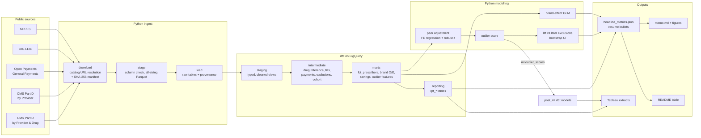
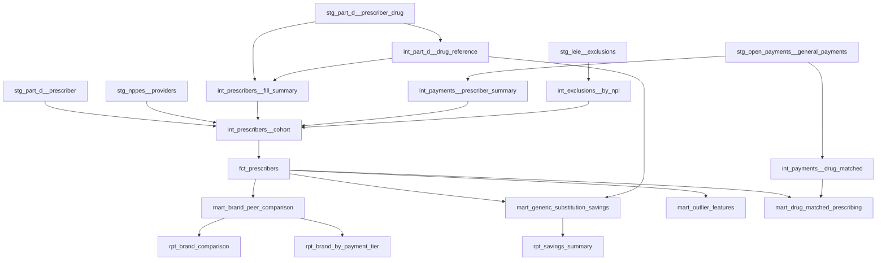

# Architecture

## Pipeline

## dbt lineage (simplified)

Run `make dbt-docs` for the full, clickable lineage graph.

## Two engines, one codebase

Production runs on **BigQuery**. CI and local development run the same dbt
models on **DuckDB** against synthetic data. Dialect differences (safe casts,
date parsing, regex, division) go through `adapter.dispatch` macros in
`dbt/macros/cross_db.sql`. CI also compiles the project for BigQuery and
parses every model with sqlglot's BigQuery dialect, so a DuckDB-only function
cannot slip into the production build. See
[ADR 0001](decisions/0001-bigquery-dbt-with-duckdb-for-ci.md).

## Layers and materializations

| Layer | Materialization | Dataset | Purpose |
|---|---|---|---|
| raw | table (loader) | `partd_raw` | All-string copies of the source files + provenance |
| reference | seed | `partd_risk_reference` | Payment categories, LEIE exclusion types, state regions |
| staging | view | `partd_risk_staging` | Typing, cleaning, renaming, one model per source |
| intermediate | table | `partd_risk_intermediate` | Reusable per-drug / per-NPI aggregates and the cohort |
| marts | table | `partd_risk_marts` | Analysis-ready facts and the ML feature table |
| reporting | table | `partd_risk_reporting` | Small aggregated tables for Tableau and the memo |
| ml | table (Python) | `partd_risk_ml` | Outlier scores written back by `partd-risk model` |
