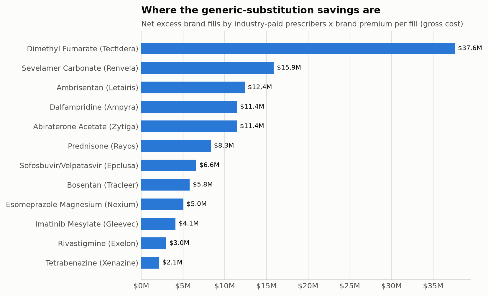

# Medicare Part D Prescribing Risk: Findings Memo

**Data year:** 2021 Part D prescribing and Open Payments program year;
OIG exclusions through the latest LEIE snapshot.
**Prepared from:** `headline_metrics.json` generated 2026-09-24T22:30:02+00:00 (duckdb).

## Bottom line

1. **Industry payments and brand-name prescribing.** After comparing each prescriber only
   with unpaid peers in the same specialty and state, industry-paid prescribers wrote
   **14% more brand-name fills** than expected.
   A regression that also accounts for patient mix and prescribing volume puts the
   difference at **+13%**.
2. **Potential savings.** Bringing paid prescribers' brand use down to their unpaid peers'
   level, on drugs where a generic version was dispensed, is worth about
   **$128M a year** in gross Part D drug spending,
   before manufacturer rebates. With brand rebates and only partial switching it falls to as
   little as $38M.
3. **An early-warning score, tested on exclusions it never saw.** The score's weights were
   learned from exclusions before 2024-01-01. On exclusions after that
   date, the 1% of prescribers it ranked highest accounted for **4.1x** their
   expected share (16 of 389).

## What we looked at

| Source | Records |
|---|---|
| `part_d_prescriber_drug` | 25,231,862 |
| `part_d_prescriber` | 1,287,454 |
| `open_payments_general` | 11,558,469 |
| `leie_exclusions` | 84,001 |
| `nppes_providers` | 9,798,758 |
| **Total** | **47,960,544** |

The analysis covers **671,051** individual prescribers
with enough Part D volume to measure reliably, of whom
**319,128** (48%)
received at least one drug-related industry payment.

## Finding 1: industry payments and brand-name prescribing

| Industry payments received | Prescribers | Brand-name fills vs. expected |
|---|---:|---:|
| none | 284,303 | -2% |
| $1-99 | 125,409 | +4% |
| $100-999 | 181,691 | +13% |
| $1,000-9,999 | 66,569 | +23% |
| $10,000+ | 13,079 | +32% |

The same comparison split by the kind of relationship with industry:

| Type of relationship | Prescribers | Brand-name fills vs. expected |
|---|---:|---:|
| none | 284,303 | -2% |
| meals only | 288,198 | +10% |
| other payments | 66,129 | +20% |
| speaker / consulting fees | 32,421 | +33% |

**How to read this.** "Expected" is what a prescriber would write if they used brand
names at the same rate as unpaid prescribers in their specialty and state. The
comparison shows an association, not proof that payments cause the prescribing:
companies may target prescribers who already favour their products.

## Finding 2: the money

| Drug (example brand) | Estimated savings |
|---|---:|
| Dimethyl Fumarate (Tecfidera) | $38M |
| Sevelamer Carbonate (Renvela) | $16M |
| Ambrisentan (Letairis) | $12M |
| Dalfampridine (Ampyra) | $11M |
| Abiraterone Acetate (Zytiga) | $11M |
| Prednisone (Rayos) | $8.3M |
| Sofosbuvir/Velpatasvir (Epclusa) | $6.6M |
| Bosentan (Tracleer) | $5.8M |
| Esomeprazole Magnesium (Nexium) | $5.0M |
| Imatinib Mesylate (Gleevec) | $4.1M |

| Scenario | Estimated savings |
|---|---:|
| Headline: gross cost, full substitution | $128M |
| Gross cost, half of excess fills switched | $64M |
| Brand cost net of 15% rebates, full substitution | $102M |
| Brand cost net of 30% rebates, full substitution | $75M |
| Brand cost net of 30% rebates, half switched | $38M |
| Upper bound: all multi-source drugs (dosage forms pooled) | $565M |

The estimate covers drugs where a generic version was dispensed and there is exactly one
brand-name product (255 drugs, 54% of paid
prescribers' multi-source fills), so brand and generic are the same medicine. Drugs and
specialties where paid prescribers wrote *fewer* brand fills than peers count against the
total. Costs are CMS gross drug costs; confidential manufacturer rebates would lower the
brand price, which the rebate scenarios approximate. Including every multi-source drug
gives $565M, but that
compares different dosage forms (e.g. a topical solution with tablets) and is an upper bound.

## Finding 3: an early-warning score

**How it works.** Each prescriber is compared with peers in the same specialty and state on
9 measures: brand-name share, cost per prescription
and per patient, prescribing volume, opioid and long-acting opioid share, and industry
payments. The comparison adjusts for how sick and how poor each prescriber's patients are.
Anything unusual in the risky direction adds to the score.

**How it was tested.** The OIG exclusions were split by date. Those before
2024-01-01 (161 prescribers) were
used to learn how much each measure should count and to choose between an equal-weight and a
learned-weight score. Those from 2024-01-01 to
2026-07-31 (389 prescribers)
were held back and used only once, to measure the result below.

| Score | Top 1%: share of expected held-out exclusions |
|---|---:|
| **Chosen score (learned weights)** | **4.1x** (95% CI 2.4x-6.2x) |
| Peer-adjusted, equal weights | 2.6x |
| No peer adjustment | 1.5x |

Area under the ROC curve for the chosen score: 0.61.
The advantage is concentrated at the very top of the ranking; flagging 5-10% of
prescribers, the simpler scores do about as well.

**What the score is not.** A high score means "worth a closer look," not wrongdoing.
99.8% of prescribers in the top 1% were *not*
later excluded, and the score should only ever prioritise human review.

## Caveats

- Part D rows with fewer than 11 claims are suppressed by CMS, so very low-volume
  prescribing is not visible.
- Brand vs. generic is inferred by comparing the brand and generic names CMS
  publishes; `dbt/analyses/brand_share_vs_cms_classification.sql` compares it with
  CMS's own brand/generic split for every specialty.
- The exclusion list only contains people who are *currently* excluded; anyone
  excluded and later reinstated is not counted as an event.
- Open Payments records are matched to prescribers by NPI only.

Full methodology: `docs/methodology.md`. Limitations and responsible use:
`docs/limitations_and_ethics.md`.
